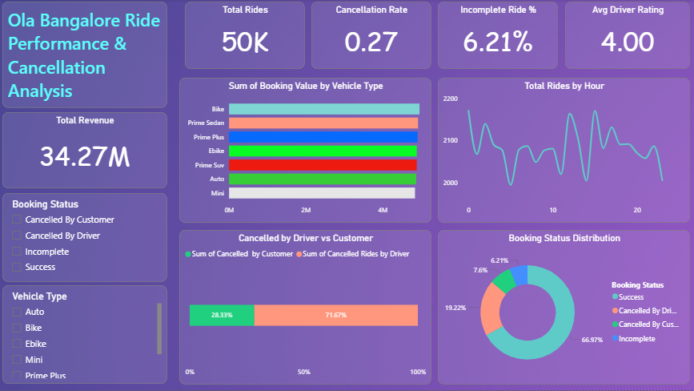
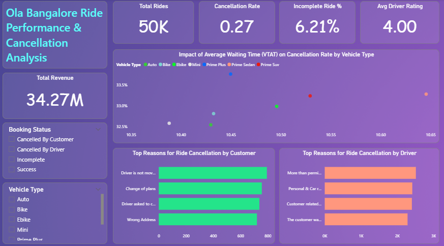
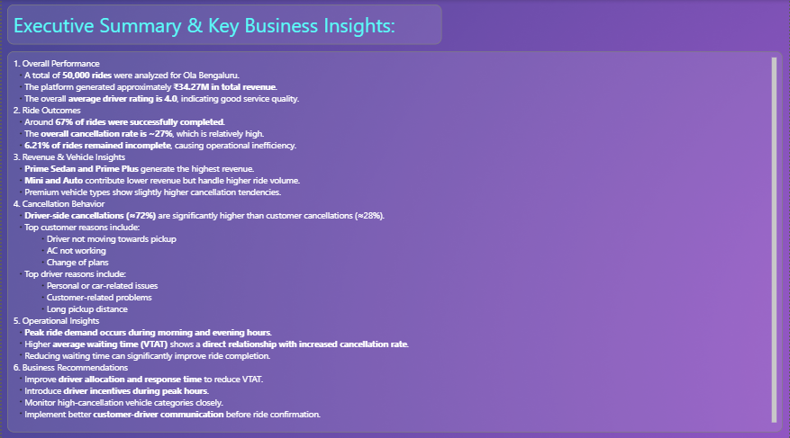

# 🚕 Ola Bangalore Ride Performance & Cancellation Analysis

## Project Overview  
This project is an end-to-end **data analytics case study** on Ola ride data for Bangalore, focused on understanding **ride performance, revenue patterns, and cancellation behavior**.

The analysis was performed using:
- **Python** for data cleaning, transformation, and exploratory analysis  
- **Power BI** for interactive dashboards and business insights  

The objective is to identify **key operational issues behind ride cancellations and incomplete rides**, and provide data-driven recommendations.

---

## What Was Done Using Python  

Python was used mainly for **data preprocessing and feature engineering** before building the dashboard.

### 1. Data Cleaning  
The raw dataset contained inconsistent text values and formatting issues.  
Using Python:
- Standardized categorical columns such as:
  - Booking Status  
  - Vehicle Type  
  - Pickup and Drop locations  
- Removed extra spaces and ensured consistent casing.

This made the dataset suitable for reliable analysis.

---

### 2. Feature Engineering  
New analytical columns were created to support business analysis, including:

- **Ride Outcome**  
  Grouped rides into:
  - Completed  
  - Cancelled  
  - Incomplete  

- **Month Column**  
  Extracted month-year from the date to support time-series analysis.

- **Driver and Customer Cancellation Flags**  
  Created binary flags to separately track:
  - Driver-side cancellations  
  - Customer-side cancellations  

These features were required for segmentation and KPI calculations.

---

### 3. Key Metrics Calculation  
Several important business metrics were computed using Python:

- Total Revenue  
- Total Rides  
- Cancellation Rate  
- Revenue by Vehicle Type  
- Top Reasons for Customer Cancellation  
- Top Reasons for Driver Cancellation  

These metrics were validated in Python and later replicated in Power BI.

---

### 4. Exploratory Data Analysis (EDA)  
Basic EDA was performed to:
- Understand distribution of ride outcomes  
- Identify most frequent cancellation reasons  
- Compare performance across vehicle types  
- Observe demand patterns over time  

The cleaned dataset was then exported for visualization.

---

## Power BI Dashboard  

After preprocessing in Python, the final dataset was imported into **Power BI** to build an interactive business dashboard.

The dashboard includes:

- KPI cards:
  - Total Rides  
  - Total Revenue  
  - Cancellation Rate  
  - Incomplete Ride %  
  - Average Driver Rating  

- Revenue analysis by vehicle type  
- Total rides by hour  
- Driver vs Customer cancellation comparison  
- Booking status distribution  
- Impact of waiting time (VTAT) on cancellations  
- Top reasons for cancellations  
- Executive summary with insights and recommendations  

---

## Dashboard Screenshots  

### Performance & Cancellation Overview  

### Cancellation Impact & Reasons  

### Executive Summary & Insights  

---

## Key Business Insights  

Some important insights derived from the analysis:

- Around **67% of rides were successfully completed**  
- **Driver-side cancellations are significantly higher** than customer cancellations  
- Long pickup distance and personal issues are major driver reasons  
- Customers often cancel due to:
  - Driver not moving  
  - AC not working  
  - Change of plans  
- Higher waiting time (VTAT) shows a **direct relationship with higher cancellation rate**  
- Prime vehicle categories generate higher revenue, while Auto and Mini handle higher volume  

---

## Business Use Case  

This project simulates a real-world scenario where such analysis can help:

- Reduce cancellation rates  
- Improve driver response times  
- Optimize fleet distribution  
- Enhance customer experience  
- Support operational decision-making  

---

## Tools & Technologies  

- Python (Pandas, NumPy)  
- Jupyter Notebook  
- Power BI Desktop  
- Power Query  
- DAX  

---

## Author  

**Mohammad Sayam Fareez**  
Aspiring Data Analyst | Power BI Developer  
Electronics Engineering Graduate (2025)

